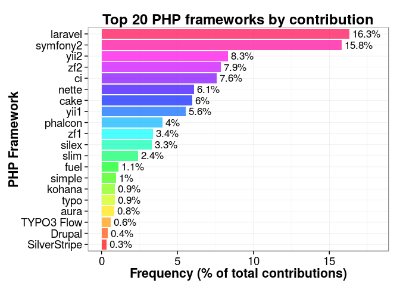

# Exploring the 2015 PHP framework survey by Sitepoint
Jesus M. Castagnetto  
April 01, 2015  

## Background

Sitepoint has published the results of their 2015 PHP Framework popularity survey[^sitepoint]. In that post they show that the survey gives a very large edge to Laravel. The people at Sitepoint were also nice enought to publish their properly anonymized dataset in a github repo[^sitepoint-github] 

[^sitepoint]: http://www.sitepoint.com/best-php-framework-2015-sitepoint-survey-results/

[^sitepoint-github]: https://github.com/sitepoint-editors/php-fw-survey-2015

So I went ahead, and forked their repo and fired up R to give this data a go.

## Exploring the dataset

I read the survey into a data frame, and looked at the overall structure:


```r
library("dplyr")
library("reshape2")
library("ggplot2")
library("knitr")
library("ROCR")
library("rpart")
library("rpart.plot")
survey <- tbl_df(read.csv("../dump/survey.csv", stringsAsFactors = FALSE))
glimpse(survey)
```

```
## Variables:
## $ id                           (int) 76, 70, 71, 72, 68, 69, 66, 87, 9...
## $ start.date                   (chr) "2015-02-27 17:16:59", "2015-02-2...
## $ submit.date                  (chr) "2015-02-27 17:19:23", "2015-02-2...
## $ network                      (chr) "7387618cfa96eeb8ac02785f782af164...
## $ age.group                    (int) 4, 3, 4, 4, 3, 3, 3, 2, 3, 3, 2, ...
## $ country                      (chr) "Slovenia", "France", "United Sta...
## $ years.php                    (int) 10, 7, 15, 10, 8, 10, 6, 3, 14, 5...
## $ years.programming            (int) 19, 13, 15, 20, 11, 15, 15, 5, 16...
## $ education                    (int) 1, 5, 6, 1, 5, 2, 3, 5, 5, 5, 5, ...
## $ numframeworks                (int) 2, 3, 2, 4, 4, 3, 1, 3, 2, 1, 2, ...
## $ fw.work.choice               (chr) "CodeIgniter", "Symfony2", "Compa...
## $ fw.work.other                (chr) "", "", "", "", "", "", "", "", "...
## $ fw.work.reason.easy          (chr) "1", "", "", "1", "1", "1", "1", ...
## $ fw.work.reason.community     (int) 1, NA, NA, NA, NA, 1, NA, NA, 1, ...
## $ fw.work.reason.tutorials     (int) 1, NA, NA, NA, NA, 1, NA, NA, NA,...
## $ fw.work.reason.tested        (int) 1, 1, NA, NA, NA, NA, NA, NA, 1, ...
## $ fw.work.reason.features      (int) 1, NA, NA, 1, 1, NA, NA, NA, NA, ...
## $ fw.work.reason.forced        (int) NA, NA, NA, 1, NA, NA, NA, 1, NA,...
## $ fw.work.reason.other         (int) NA, NA, 1, NA, 1, NA, NA, NA, 1, ...
## $ fw.work.reason.other.why     (chr) "", "", "We use Kohana", "", "", ...
## $ fw.personal.choice           (chr) "CodeIgniter", "Symfony2", "Larav...
## $ fw.personal.other            (chr) "", "", "", "", "", "", "", "", "...
## $ fw.personal.reason.easy      (chr) "1", "", "1", "1", "1", "1", "", ...
## $ fw.personal.reason.community (int) 1, NA, 1, 1, NA, 1, 1, NA, 1, NA,...
## $ fw.personal.reason.tutorials (int) 1, 1, 1, 1, NA, 1, 1, NA, NA, NA,...
## $ fw.personal.reason.tested    (int) 1, NA, NA, NA, NA, 1, NA, NA, 1, ...
## $ fw.personal.reason.features  (int) 1, NA, 1, 1, NA, 1, 1, NA, NA, NA...
## $ fw.personal.reason.other     (int) NA, NA, NA, NA, 1, NA, NA, NA, NA...
## $ fw.personal.reason.other.why (chr) "", "", "", "", "It provides the ...
## $ contributes                  (chr) "No", "No", "No", "No", "No", "No...
## $ laravel                      (int) NA, NA, NA, NA, NA, NA, NA, NA, N...
## $ yii1                         (int) NA, NA, NA, NA, NA, NA, NA, NA, N...
## $ yii2                         (int) NA, NA, NA, NA, NA, NA, NA, NA, N...
## $ zf1                          (int) NA, NA, NA, NA, NA, NA, NA, NA, N...
## $ zf2                          (int) NA, NA, NA, NA, NA, NA, NA, NA, N...
## $ symfony2                     (int) NA, NA, NA, NA, NA, NA, NA, NA, 1...
## $ phalcon                      (int) NA, NA, NA, NA, NA, NA, NA, NA, N...
## $ aura                         (int) NA, NA, NA, NA, NA, NA, NA, NA, N...
## $ slim                         (int) NA, NA, NA, NA, NA, NA, NA, NA, N...
## $ silex                        (int) NA, NA, NA, NA, NA, NA, NA, NA, N...
## $ webiny                       (int) NA, NA, NA, NA, NA, NA, NA, NA, N...
## $ cake                         (int) NA, NA, NA, NA, NA, NA, NA, NA, N...
## $ fuel                         (int) NA, NA, NA, NA, NA, NA, NA, NA, N...
## $ kohana                       (int) NA, NA, NA, NA, NA, NA, NA, NA, N...
## $ ci                           (int) NA, NA, NA, NA, NA, NA, NA, NA, N...
## $ prado                        (int) NA, NA, NA, NA, NA, NA, NA, NA, N...
## $ phpixie                      (int) NA, NA, NA, NA, NA, NA, NA, NA, N...
## $ flight                       (int) NA, NA, NA, NA, NA, NA, NA, NA, N...
## $ simple                       (int) NA, NA, NA, NA, NA, NA, NA, NA, N...
## $ typo                         (int) NA, NA, NA, NA, NA, NA, NA, NA, N...
## $ nette                        (int) NA, NA, NA, NA, NA, NA, NA, NA, N...
## $ agavi                        (int) NA, NA, NA, NA, NA, NA, NA, NA, N...
## $ other                        (chr) "", "", "", "", "", "", "", "", "...
```

It seems that the first 30 columns related to personal
information and preferences for each respondent (identified by the
`id` field). The next 22 columns comprise a very sparse matrix that
encodes what frameworks (including a write-in option) the respondent
has made contributions.

So I decided to look extract that section of the dataset and do some
quick analysis looking at the frequencies, and how it compared with
the results of framework popularity.

The reason to do that, is to try and get a feeling on the extent to which
each project (framework) has a community that not only benefits from it, but
also works towards improving it by contributing to the code, documentation, etc.

Let's look first at the contributions to the list of selected frameworks:


```r
# the framework contribution "matrix"
contrib <- survey %>% select(id,laravel:agavi)
ncontrib <- as.data.frame(
  table(rowSums(contrib[, -1], na.rm=TRUE))) %>%
  mutate(pFreq=round(100*Freq/nrow(contrib), 2))
colnames(ncontrib) <- c("Number of frameworks",
                       "Count", "Percent of total")
kable(ncontrib, align=c("c", "c", "c"),
      caption="Distribution of number of frameworks contributed to by respondents")
```


Table: Distribution of number of frameworks contributed to by respondents

 Number of frameworks    Count    Percent of total 
----------------------  -------  ------------------
          0              6327          81.80       
          1              1033          13.35       
          2               239           3.09       
          3               84            1.09       
          4               31            0.40       
          5               11            0.14       
          6                4            0.05       
          7                5            0.06       
          8                1            0.01       

So, about 18.2% of survey respondents contribute
to at least one framework (without including the "write-ins")

Now, I will convert the data from a "wide" to a "long"
format, using the `reshape2` package, and also mangle the
the write-ins (`other` field) to be able to combine that 
with the other data. 


```r
contrib.long <- melt(contrib, id.vars = "id",
                     variable.name = "framework", 
                     value.name = "count",
                     na.rm = TRUE)
head(contrib.long)
```

```
##     id framework count
## 14 134   laravel     1
## 40 214   laravel     1
## 68 328   laravel     1
## 77 365   laravel     1
## 82 381   laravel     1
## 94 427   laravel     1
```

```r
summary(contrib.long)
```

```
##        id           framework       count  
##  Min.   :   99   laravel :355   Min.   :1  
##  1st Qu.: 7594   symfony2:344   1st Qu.:1  
##  Median :15986   yii2    :181   Median :1  
##  Mean   :19142   zf2     :171   Mean   :1  
##  3rd Qu.:29910   ci      :165   3rd Qu.:1  
##  Max.   :47233   nette   :132   Max.   :1  
##                  (Other) :661
```

It seems that the `count` field is not informative at all, so we can safely
remove it.


```r
contrib.long <- contrib.long[,1:2]
```

While mangling the "write-ins", I noticed a large amount of empty
answers, which is reasonable if you consider that the options 
given in the survey contained the most popular frameworks.


```r
# the write-ins
contrib.writeins <- survey[,c(1,53)]
nrow(contrib.writeins)
```

```
## [1] 7735
```

```r
head(contrib.writeins)
```

```
## Source: local data frame [6 x 2]
## 
##   id other
## 1 76      
## 2 70      
## 3 71      
## 4 72      
## 5 68      
## 6 69
```

```r
# let's remove the empty rows
contrib.writeins <- subset(contrib.writeins, other != "")
nrow(contrib.writeins)
```

```
## [1] 168
```

```r
head(contrib.writeins)
```

```
## Source: local data frame [6 x 2]
## 
##       id                other
## 135  556 Simple MVC Framework
## 215  884               drupal
## 226  925 Simple MVC Framework
## 276 1122 Simple MVC Framework
## 278 1131 Simple MVC Framework
## 287 1169                nette
```

In the end there are only 168 write-in answers out 
of 7735 responses. A proportion of about 
2.17% of answers to the survey.

Finally, I combined the two data frames to get all possible 
frameworks to which people are contributing. 
Also, went ahead and removed the string " framework" 
from the framework's name, to help group better, because there were entries
such as "xyz" and "xyz framework".


```r
colnames(contrib.writeins) <- c("id", "framework")
contrib.long <- rbind(contrib.long, contrib.writeins)
contrib.long$framework <- gsub(" framework","",
                               contrib.long$framework)
```
### Computing the frequencies of contributions

I used `dplyr` to quickly summarize the results in the long data
frame, calculating the frequency count and percent for each
framework. 

One thing I noticed is that there was a small number of
entries such as: "_i also contribute to php itself_" or
"_took part in customer's development, also fixed codeigniter long tim_", and most of these anomalous "frameworks" were single cases,

Using this summary, I made a bar chart of the top 20 frameworks
to which people contribute, with the package `ggplot2`.


```r
contrib.summ <- contrib.long %>% 
  group_by(framework) %>% 
  summarise(freq=n(), pfreq=100*n()/nrow(contrib.long)) %>% 
  arrange(desc(freq))
contrib.summ$framework <- factor(contrib.summ$framework, 
                                levels=rev(contrib.summ$framework),
                                ordered=TRUE)
top20 <- contrib.summ[1:20,]

ggplot(top20, aes(x=framework, y=pfreq)) + 
  geom_bar(stat="identity", fill=rainbow(20), alpha=0.7) +
  geom_text(label=paste0(" ",round(top20$pfreq,1), "%"), hjust=0, size=4.5) +
  xlab("PHP Framework") +
  ylab("Frequency (% of total contributions)") +
  ylim(c(0,18)) +
  ggtitle("Top 20 PHP frameworks by contribution") +
  coord_flip() +
  theme_bw() +
  theme(axis.text=element_text(size=14),
        axis.title=element_text(size=16, face="bold"),
        plot.title=element_text(size=18, face="bold"))
```

 

## Comparisons with the votes for popular frameworks

Let's now look at the correspondence between frameworks used for work and 
personal projects, and whether the respondent contributes
to at least one framework.


```r
personal <- survey[,c(1,5:11,21,30)]
survey$samefw <- survey$fw.work.choice == survey$fw.personal.choice
survey$contributes <- rowSums(contrib[, -1], na.rm=TRUE) > 0
(xt1 <- xtabs( ~ samefw + contributes, survey))
```

```
##        contributes
## samefw  FALSE TRUE
##   FALSE  2055  350
##   TRUE   4272 1058
```

Out of every ~7 people who use different frameworks for work and personal projects,
1 contributes to at least one of those frameworks. And, out of ~5 people who
use the same framework at work and personal projects, 1 contributes to at least
one framework.


```r
xt2 <- round(100*xt1 / nrow(survey), 1)
```

If we look at this in overall percentages of respondents, we find that:

- 26.6% use different frameworks for work and personal
  projects, and do not contribute to any framework
- 4.5% use different frameworks but contribute to at
  least one framework
- 55.2% use the same framework for work and personal
  projects, but do not contribute to any framework
- 13.7% use the same framework and contribute to at
  least to one of them

Will there be a difference between contributions for the most popular framework
(according to Sitepoint's 2015 survey): Laravel? How about for the second most
popular: Symfony2?

Again, we use dplyr to summarize this data. First for the use at work, filtering
for the cases where the total number of entries of at least 20 for the framework,
and for entries with an empty name:


```r
contrib_fw_work <- survey %>% 
  select(id, fw.work.choice, contributes) %>% 
  group_by(fw.work.choice) %>% 
  summarise(ncontrib=sum(contributes), ntotal=n()) %>% 
  filter(ntotal >= 20 & fw.work.choice !="" ) %>% 
  mutate(pcontrib=ncontrib/ntotal) %>% 
  arrange(desc(pcontrib))
contrib_fw_work %>% filter(fw.work.choice %in% c("Laravel", "Symfony2"))
```

```
## Source: local data frame [2 x 4]
## 
##   fw.work.choice ncontrib ntotal  pcontrib
## 1       Symfony2      245   1067 0.2296157
## 2        Laravel      273   1658 0.1646562
```

And next for the personal use:


```r
contrib_fw_personal <- survey %>% 
  select(id, fw.personal.choice, contributes) %>% 
  group_by(fw.personal.choice) %>% 
  summarise(ncontrib=sum(contributes), ntotal=n()) %>% 
  filter(ntotal >= 20 & fw.personal.choice !="" ) %>% 
  mutate(pcontrib=ncontrib/ntotal) %>% 
  arrange(desc(pcontrib))
contrib_fw_personal %>% filter(fw.personal.choice %in% c("Laravel", "Symfony2"))
```

```
## Source: local data frame [2 x 4]
## 
##   fw.personal.choice ncontrib ntotal  pcontrib
## 1           Symfony2      241   1005 0.2398010
## 2            Laravel      314   2110 0.1488152
```

So Laravel (the most popular framework) has a community engamement (contribution) of
about 15-16%, and Symfony2 something between 23-24%.

If we look at the top 3 frameworks as measured by contributions, the situation
is quite different than the popularity statistics:


```r
kable(contrib_fw_work[1:3,], digits = 2, 
      caption="Ranking of frameworks used at work by contribution")
```


Table: Ranking of frameworks used at work by contribution

fw.work.choice      ncontrib   ntotal   pcontrib
-----------------  ---------  -------  ---------
Typo 3                    20       35       0.57
CakePHP                   80      254       0.31
Zend Framework 2         109      390       0.28


```r
kable(contrib_fw_personal[1:3,], digits = 2, 
      caption="Ranking of frameworks used for personal projects by contribution")
```


Table: Ranking of frameworks used for personal projects by contribution

fw.personal.choice    ncontrib   ntotal   pcontrib
-------------------  ---------  -------  ---------
Typo 3                      12       20       0.60
CakePHP                     73      229       0.32
Zend Framework 2           107      346       0.31

It is interesting that these are frameworks that are quite mature and have been
around for quite some time.

## Modeling contribution

The following is not strict modeling, at best it is a preliminary
exploration on trying to figure out if it is possible to 
understand contributions in terms of the variables acquired.

First, we need to calculate the base accuracy, i.e. assigning
to all rows the most frequent value for contribution (`FALSE`).


```r
(base_acc <- sum(survey$contributes==FALSE) / nrow(survey))
```

```
## [1] 0.8179703
```

Then, we try a logistic regression (why not?), and let's not
worry about possible colinearity and other hairy issues.


```r
survey$age.group <- factor(survey$age.group)
survey$education <- factor(survey$education)
logmodel <- glm(contributes ~ samefw + age.group + years.php +
                years.programming + education + numframeworks,
                data=survey, family="binomial")
summary(logmodel)
```

```
## 
## Call:
## glm(formula = contributes ~ samefw + age.group + years.php + 
##     years.programming + education + numframeworks, family = "binomial", 
##     data = survey)
## 
## Deviance Residuals: 
##     Min       1Q   Median       3Q      Max  
## -2.3538  -0.6675  -0.5746  -0.4538   2.6024  
## 
## Coefficients:
##                     Estimate Std. Error z value Pr(>|z|)    
## (Intercept)       -2.4184238  0.2683388  -9.013  < 2e-16 ***
## samefwTRUE         0.3937101  0.0686493   5.735 9.75e-09 ***
## age.group2         0.2776321  0.2564490   1.083 0.278985    
## age.group3        -0.1709346  0.2594904  -0.659 0.510068    
## age.group4        -0.4791895  0.2786983  -1.719 0.085544 .  
## age.group5        -1.2118313  0.3650170  -3.320 0.000900 ***
## years.php          0.0665785  0.0121997   5.457 4.83e-08 ***
## years.programming  0.0008912  0.0092778   0.096 0.923473    
## education2        -0.0907414  0.1302166  -0.697 0.485897    
## education3        -0.4092336  0.1394284  -2.935 0.003335 ** 
## education4        -0.2101331  0.1028052  -2.044 0.040954 *  
## education5        -0.0983835  0.0884050  -1.113 0.265763    
## education6         0.1336008  0.0992409   1.346 0.178229    
## education7         0.8844739  0.2572563   3.438 0.000586 ***
## numframeworks      0.0982868  0.0155403   6.325 2.54e-10 ***
## ---
## Signif. codes:  0 '***' 0.001 '**' 0.01 '*' 0.05 '.' 0.1 ' ' 1
## 
## (Dispersion parameter for binomial family taken to be 1)
## 
##     Null deviance: 7339.9  on 7734  degrees of freedom
## Residual deviance: 7099.5  on 7720  degrees of freedom
## AIC: 7129.5
## 
## Number of Fisher Scoring iterations: 4
```

```r
logpred <- predict(logmodel, type="response")
(logct <- table(logpred >= 0.5, survey$contributes))
```

```
##        
##         FALSE TRUE
##   FALSE  6317 1394
##   TRUE     10   14
```

```r
(log_acc <- (logct[1,1] + logct[2,2]) / nrow(survey))
```

```
## [1] 0.8184874
```

The logistic model seem to indicate that the total number of years
of programming experience is not as significative, as, for example,
the number of year programming in PHP, at least to predict 
contributions to PHP frameworks.

As we can see there is a slight improvement in the accuracy using
this naive model, going from 0.8179703 (the base value)
to 0.8184874, a difference of just
$5.1712993\times 10^{-4}$

We can now plot and calculate the AUC that we can expect 
with this model.


```r
rpred1 <- prediction(logpred, survey$contributes)
perf1 <- performance(rpred1, measure="tpr", x.measure="fpr")
plot(perf1, main="ROC curve for logistic model")
abline(a=0, b=1, lty="dashed", col="blue")
```

 

```r
(auc1 <- as.numeric(performance(rpred1, "auc")@y.values))
```

```
## [1] 0.6288363
```

Better than the baseline of 0.5, but not that great. Also,
this model gives us still a great number of false negatives:
people predicted not to contribute, but that do otherwise.

Finally we will try to use a classification tree, and see if 
can get a better model. 


```r
treemodel <- rpart(contributes ~ samefw + age.group + years.php +
               years.programming + education + numframeworks,
               data=survey,
               method = "class", cp=0.001)
prp(treemodel)
```

 

```r
treepred <- predict(treemodel, type="class")
(treect <- table(treepred, survey$contributes))
```

```
##         
## treepred FALSE TRUE
##    FALSE  6303 1352
##    TRUE     24   56
```

```r
(tree_acc <- (treect[1,1] + treect[2,2]) / nrow(survey))
```

```
## [1] 0.8221073
```

The resulting tree is a bit complex, and might be overfitted, and
as we can see, affords a slight improvement in the accuracy, 
going from 0.8179703 (the base value)
to 0.8184874, a difference of just
$5.1712993\times 10^{-4}$

Bottomline: I am not convinced that we can model contribution using the
variables collected in this survey. Of course, that was not the goal of
the survey, so it there is no surprise there.
